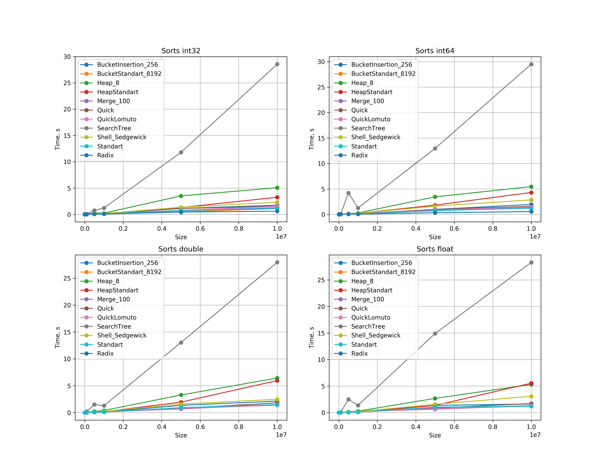
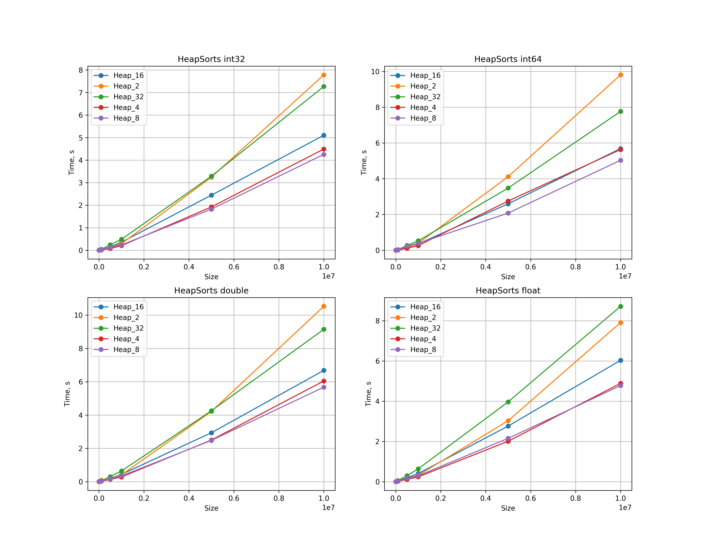

# Результат запуска сортировок на типах данных int32, int64, float, double с равномерным распределением

# Оптимальное значение k для k-MergeSort 

# Оптимальное значение d для d-HeapSort

# Оптимальное значение доли для BucketStandartSort

# Оптимальное значение доли для BucketInsertionSort

# Сравнение BucketInsertionSort, BucketStandartSort на равномерных и нормальных входных данных

