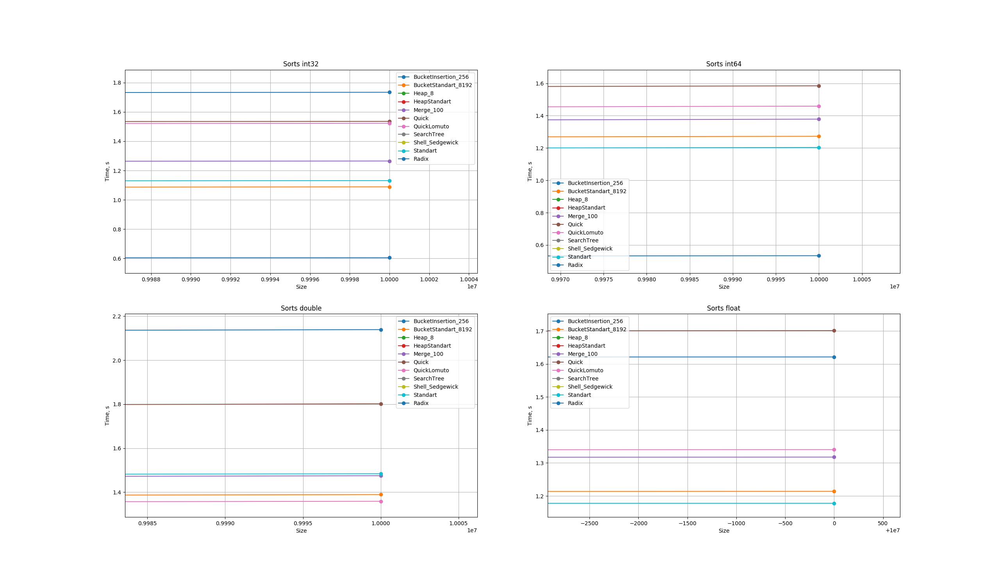

# Результат запуска сортировок на типах данных int32, int64, float, double с равномерным распределением

	
int32         	| int64          | float         	| double          |
------------- 	| -------------  | ------------- 	| -------------   |
Radix		  	| Radix		     | BucketStandart   | Standart		  |
BucketStandart  | BucketStandart | Standart		  	| BucketStandart  |
Standart	  	| Standart	     | Quick		  	| QuickLomuto	  |

# Оптимальное значение k для k-MergeSort 

Оптимальное значение **k = 100**

# Оптимальное значение d для d-HeapSort

Оптимальное значение **d = 8**

# Оптимальное значение доли для BucketStandartSort

Оптимальное число карманов **size/8192**

# Оптимальное значение доли для BucketInsertionSort

Оптимальное число карманов **size/256**

# Сравнение BucketInsertionSort, BucketStandartSort на равномерных и нормальных входных данных

	**BucketInsertionSort** деградирует при смене распределения, так как сортировка вставками хуже справляется с большими массивами,
	которые появляются из-за более высокой концентрации элементов в окрестности матожидания нормального распределения.

	**BucketStandartSort** менее зависима от смены равномерного распределения на нормальное, так как использует std::sort,
	которая работает достаточно быстро на больших массивах.